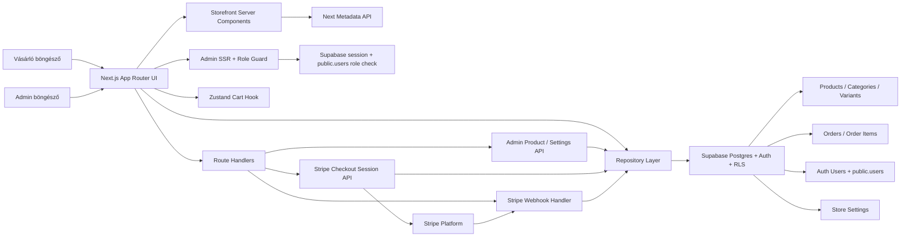

# Webshop Engine Architecture

## Fő döntések

- A nézet és üzleti logika szét van választva: a UI komponensek a `components/` alatt, az állapot és kliens oldali logika a `hooks/` és `lib/repositories/` rétegekben kap helyet.
- Az admin felület védelme szerveroldalon történik a `requireAdmin()` ellenőrzéssel, ami Supabase sessionből és a `public.users.role` mezőből dolgozik.
- A Stripe kulcsok és az adatbázis kulcsok kizárólag környezeti változókból olvashatók.
- A termékmodell külön kezeli a `product_options`, `product_option_values`, `product_variants` és `product_variant_option_values` táblákat, ezért a méret és szín jellegű kombinációk jól skálázhatók.
- A webhook Node.js runtime-on fut, mert a Stripe aláírás ellenőrzéséhez nyers request body szükséges.
